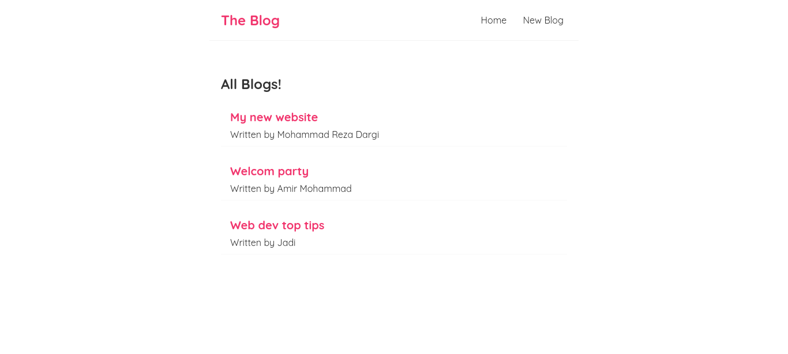
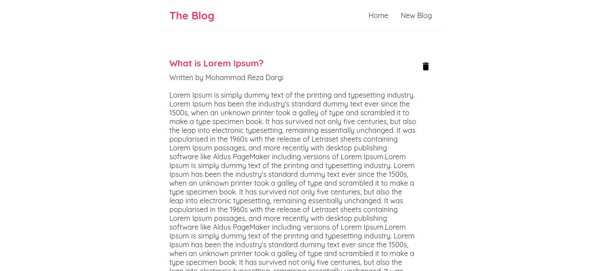
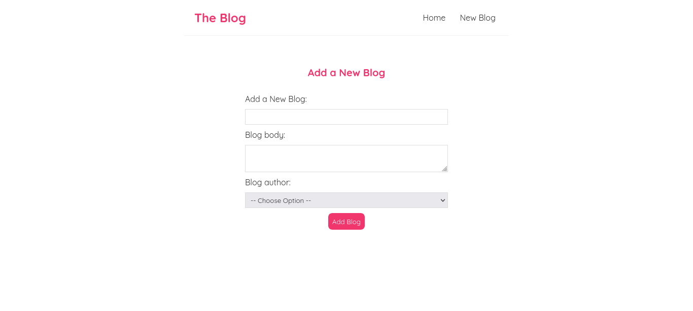

# ReactJs Blog

The purpose of creating this project was how can I sync a ReactJs app as part of front-end to NodeJs
that I use as back-end, in this project I keep everything simple so I can understand how should I connect them to each other.

## Screenshot

### #1: Home Page:

### #2: Blog Post Detail Page:

### #3: Create New Blog Page:

## My process

### Built with

- Semantic HTML5 markup
- CSS custom properties
- Flexbox
- [React](https://reactjs.org/) - JS library
- [React Router](https://reactrouter.com/)
- [Node.js](https://nodejs.org/en)

### Continued development

## Author

- Mr.d